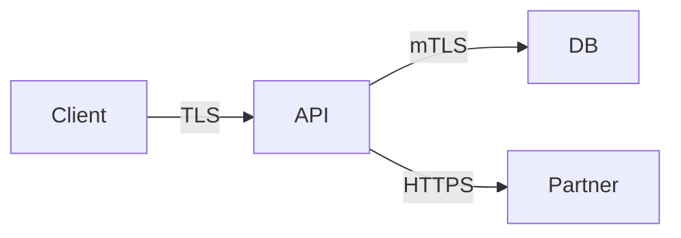

# Threat model sketch

Produce a concise STRIDE-based threat model for a feature, service, or architecture change without a full formal TM session.

## When to use

- New API endpoint, auth flow, or data store
- Feature touches PHI, credentials, or device control
- Architecture review before PI commitment
- Security sign-off requested for design doc or ADR

## Workflow

```
Threat model:
- [ ] Step 1: Define scope and assets
- [ ] Step 2: Draw trust boundaries and data flows
- [ ] Step 3: STRIDE per component
- [ ] Step 4: Map threats to CWE/MITRE patterns
- [ ] Step 5: Define mitigations and residual risk
- [ ] Step 6: Output sketch and action items
```

### Step 1: Scope

Document:

| Item | Example |
|------|---------|
| Feature / service | Patient alarm sync API |
| In scope | REST API, mobile client, cloud broker |
| Out of scope | Legacy on-prem gateway |
| Assets | Patient IDs, alarm metadata, session tokens |
| Actors | Clinician, patient, anonymous, compromised device |

### Step 2: Trust boundaries

Identify boundaries where data or control crosses:

- User device ↔ network
- Network ↔ service
- Service ↔ database / third party
- Admin ↔ production

Sketch with mermaid when helpful:



### Step 3: STRIDE worksheet

For each component at each boundary, ask:

| STRIDE | Question |
|--------|----------|
| **S**poofing | Can an actor impersonate another user or service? |
| **T**ampering | Can data in transit or at rest be modified undetected? |
| **R**epudiation | Can actions occur without audit trail? |
| **I**nformation disclosure | Can sensitive data leak to unauthorized parties? |
| **D**enial of service | Can availability be degraded cheaply? |
| **E**levation of privilege | Can a low-privilege actor gain higher access? |

Record only **credible** threats for the scoped design — skip generic noise.

### Step 4: Link to CWE

For each threat, note likely CWE classes (use `cwe-code-analysis` patterns for implementation review):

| Threat | Example CWE |
|--------|-------------|
| SQL injection on search API | CWE-89 |
| Missing authz on record update | CWE-862 |
| Session fixation | CWE-384 |
| Sensitive data in logs | CWE-532 |

### Step 5: Mitigations

For each threat:

| Field | Content |
|-------|---------|
| Threat | [STRIDE category + description] |
| Risk | Critical / High / Medium / Low |
| Mitigation | [control: authz, encryption, rate limit, etc.] |
| Status | Planned / Implemented / Gap |
| Verification | [test, pen test, code review, scanner] |

Prefer **built-in platform controls** (OIDC, API gateway, managed KMS) before custom security code.

## Output format

```markdown
# Threat model sketch: [feature name]

## Scope and assets
[Table from Step 1]

## Architecture
[Diagram or bullet data flows]

## Threat register

| ID | STRIDE | Threat | Risk | CWE | Mitigation | Status |
|----|--------|--------|------|-----|------------|--------|
| T1 | I | ... | High | CWE-200 | ... | Gap |

## Residual risks
[Accepted risks with rationale and owner]

## Security test recommendations
1. [Specific tests aligned to threats]

## Action items
| Owner | Action | Due |
|-------|--------|-----|
| ... | ... | ... |
```

## Baxter / platform notes

- Apply **platform governance** when the feature may be product-specific vs shared platform ("It's Platform until it isn't")
- Regulated features: link threats to Polarion requirements and ADO stories for traceability
- Embedded devices: include physical access, firmware update channel, and factory provisioning boundaries
- Clinical context: prioritize patient safety and PHI exposure over generic IT risks

## Rules

- Threat models are **living** — update when scope or architecture changes
- Do not treat mitigations as verified without evidence (code, config, test)
- Keep sketches actionable; avoid 20-page formal TM unless program requires it
- Escalate Critical/High gaps without mitigation before release

## Related skills

- `security-review` — implementation-phase review
- `cwe-code-analysis` — verify weakness patterns in code
- `cve-impact-analysis` — third-party component risks
